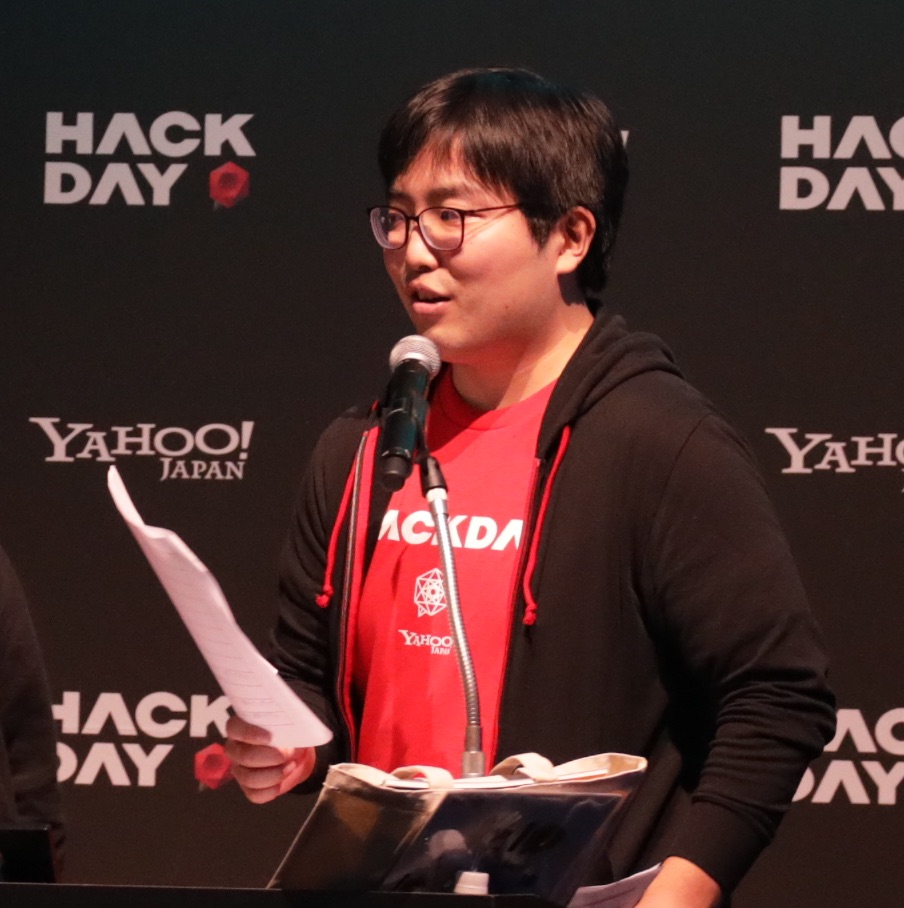

# コンポーネント座談会

## 概要 (100文字程度)

コンポーネントに関する質問をY!のReact・Vue・Angular勢のそれぞれの視点でお答えします。また「うちはこうしてる」も大歓迎なので、一緒に議論しましょう。

## 登壇者情報

### お名前 

- 穴井宏幸（あないひろゆき）
- 伊藤康太（いとうこうた）
- 加藤佑典（かとうゆうすけ）

### プロフィール画像

### 所属、肩書きなど（任意）

- 穴井
  - 所属1: ヤフー株式会社
  - 肩書1: 第7代黒帯
  - 所属2: リッチラボ株式会社
  - 肩書2: エンジニア
- 伊藤
  - 所属: ヤフー株式会社
  - 肩書: クリエイターエバンジェリスト
- 加藤
  - 所属: ヤフー株式会社
  - 肩書: スタンダード言語サポート

## SNSs、ブログ等 (任意)

- 穴井
  - https://twitter.com/pirosikick
- 伊藤
  - twitter: https://twitter.com/koh110
  - github: https://github.com/koh110
- 加藤
  - https://github.com/ikasumiwt

## 事前確認

### 当日に使用する機材

- 利用するマシンOS macOS
- 必要なコネクタ端子 USB Type-C

### 写真、スライド公開などの可否

- [x] 参加者などによるソーシャル投稿
- [x] 写真の公開（各種イベントレポートなど）
- [ ] 資料の公開（もしあれば）

※ 可の項目にチェックをつけていただき、他に特筆事項があれば併記ください

